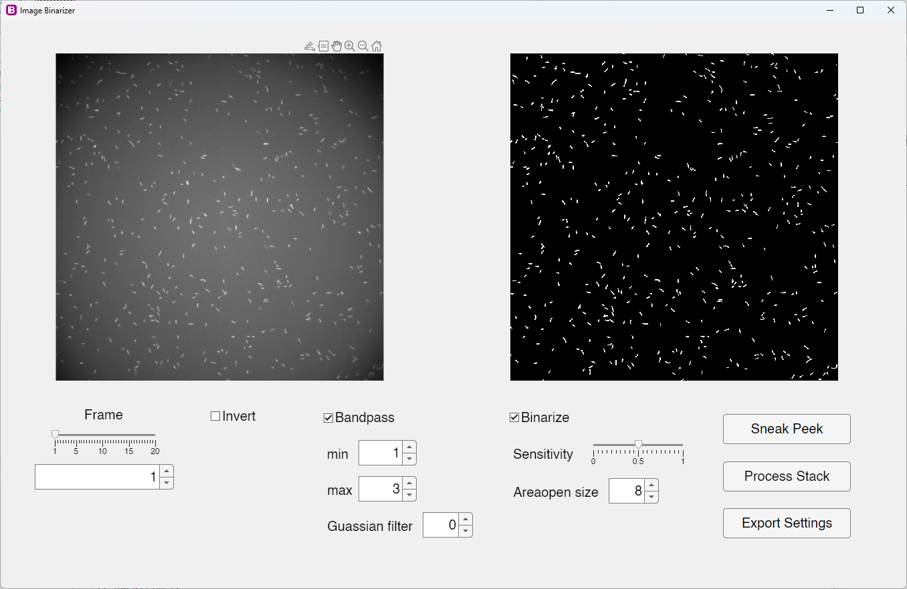

#  ImageBinarizer


Fast and accurate image binarization makes simple.

The Image Binarizer is a user-friendly MATLAB program designed to provide an intuitive interface for binarizing images. With this program, users can easily adjust various parameters to achieve the desired binarization results.

## Features

- **Interactive GUI**: The program provides an intuitive graphical user interface that allows users to adjust binarization parameters effortlessly.
- **Real-time Preview**: Users can instantly see the effects of their adjustments on the binarized image through the real-time preview feature.
- **Batch Processing**: Binarization parameters can be exported for batch processing, enabling users to apply the same settings to a large number of images efficiently.

## Getting started

### Requirements

- MATLAB
- Image Processing Toolbox (install via 'Home' --> 'Add-Ons')

### Installation

> Choose one of the following methods:

1. Clone the repository using [`git`](https://git-scm.com/)

   ```sh
    git clone https://github.com/tytghy/ImageBinarizer.git
   ```

2. Download the ZIP file from [**ImageBinarizer**](https://github.com/tytghy/ImageBinarizer).

## Algorithm

The Image Binarizer applies a series of image processing steps to binarize the input image stack IMG. It first applies a bandpass filter using the same algorithm as the bandpass filter in ImageJ. The filtered image is then further processed by a Gaussian filter and finally thresholded using adaptive binarization.

## Usage

Using the Image Binarizer App is straightforward:

1. Launch the app by running `bwgui(img)` in MATLAB, where `img` is the image stack to be processed.
2. Adjust the binarization parameters using the provided UI controls:
   - **Inversion**: Enable or disable image intensity inversion to accommodate different image
   - **Bandpass Filtering**: Enable or disable bandpass filtering and set the minimum and maximum frequencies to enhance the image.
   - **Gaussian Filtering**: Adjust the Gaussian filter sigma value to reduce noise in the image.
   - **Binarization**: Enable or disable binarization and adjust the sensitivity threshold to control the binarization process.
   - **Area Opening**: Set the minimum size of objects to keep after binarization, removing small artifacts.
     types.
3. Get a glimpse with the "Sneak Peek" button, which processes and displays the first 10 images of your stack.
4. Click the "Process Stack" button to apply the selected image processing techniques to the entire image stack in one go.
5. Want to save your image processing recipe for future use? Click the "Export Settings" button to export the current parameters and share them with others or use them for batch processing.



> **Note**
>
> Exported parameters `bwPara` and binarized image stack `bw` have different indexes to avoid overwrite.

## Batch Processing

The Image Binarizer supports batch processing, allowing you to apply the same binarization parameters to a large number of images efficiently. To perform batch processing:

1. Load the image stack into the app and adjust the binarization parameters as desired.
2. Export the binarization parameters using the "Export Settings" button.
3. Use the exported parameters with the `bwfun(@(x) getbw(x, bwPara), imgToBeProcessed)` to process the image stack.

## Example (see `demo.m`):

```matlab
% Load the image stack
load('sample/img.mat');

% Export the binarization parameters using the app
bwgui(img);

% Perform batch processing using the exported parameters
bw = bwfun(@(x) getbw(x, bwPara), img);
```

## References

- The book "Digital Image Processing Using MATLAB" and the corresponding codes [DIPUM](https://github.com/dipum/dipum-toolbox).
- [FFTFilter.java](https://imagej.net/ij/developer/source/ij/plugin/filter/FFTFilter.java.html), which served as the basis for our bandpass filter implementation.

## License

The Image Binarizer is licensed under the [MIT License](LICENSE).
